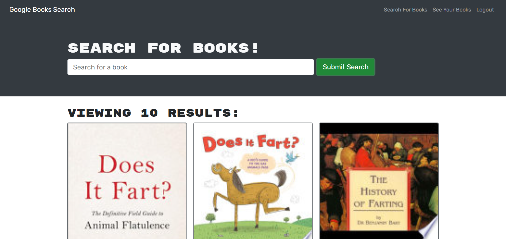

  <h1>Read-Em-All Book Search Engine</h1>

  
    
  

  
  ## Table of Contents
  -[Description](#description)  

  -[Installation](#installation)  

  -[Usage](#usage)  
  
  -[License](#license)  
  
  -[Contribution](#contribution)  

  -[Tests](#tests)  

  -[Questions](#questions)  

  ## Description

  A site that will allow the user to sign up and view and save a list of books using a google api.
  
  
  ## Installation
  npm install
  
  ## Usage
  go to web browser and open.
  [Heroku Deployment](https://powerful-lowlands-01837.herokuapp.com/)
  
  ## License
  
  This was created under the MIT license.
  
  
  ## Contribution
  No need to contribute.
  
  ## Tests
  N/A
  
  ## Questions
  
  Any questions, comments or concerns, reach out at light2adrifter@yahoo.com.

  Git hub available at: [light2adrifter](https://github.com/light2adrifter/Read-em-all).

  

